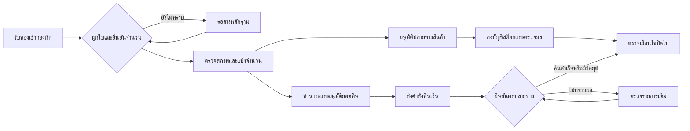

# ระบบรับคืนสินค้า: แบบฉบับเต็มและเมทริกซ์ทดสอบ

งาน t_mtx4rut2 · Codex · 13 ก.ย. 2569 · ออกแบบก่อน ยังไม่เขียนโค้ดหรือเปลี่ยนฐาน/สต็อก/เงิน
อ้างอิง gucut-web 4e19553 และ gucut-next 6204713

## 1. ผลลัพธ์ที่ต้องได้

พนักงานรับของจริงได้แม้ยังหาใบขายไม่พบ เจ้าหน้าที่ตรวจสภาพและแยกของขายได้ออกจากของกัก/ของเสีย ผู้มีสิทธิ์อนุมัติคืนเงินแยกจากการรับสินค้า ทุกหน่วยและทุกจำนวนเงินตามย้อนถึงใบขาย เหตุการณ์รับคืน และหลักฐานปลายทางได้ กดซ้ำ/เน็ตหลุด/คนทำพร้อมกันต้องไม่เพิ่มของหรือคืนเงินซ้ำ

คำว่า “รับของแล้ว”, “เข้าสต็อกขายได้แล้ว”, “อนุมัติคืนเงินแล้ว”, “โอนเงินคืนสำเร็จแล้ว” เป็นคนละเหตุการณ์ ห้ามใช้สถานะเดียวแทนทั้งหมด และไม่แก้ถ้อยคำหรือนโยบายหน้าร้าน /policy/* ในงานนี้

## 2. สิ่งที่มีอยู่แล้ว — ต่อจากของเดิม

| ส่วน | ของเดิม | ข้อกำหนดการต่อเติม |
|---|---|---|
| จุดรับของ | core-returns.mjs:337 receiveReturn มี matched/unmatched และเลขกัก | รักษาเลขอ้างอิง/ทาง resume ไม่สร้างระบบรับของคู่ขนาน |
| เอกสาร | returns_desk, returns_desk_items, returns_desk_takeovers | คนละตารางกับ return_orders ที่เป็นกระจก ZORT ห้ามนับ/จับคู่จากชื่อคล้ายกัน |
| โควตาคืน | remainingFor อิง order_items ลบรายการที่ move_result มีค่า | ต้องใช้ source/order-line/unit และรับรู้ source ไม่สมบูรณ์; เพิ่ม reservation/concurrency ไม่ถือว่าจำนวนจากใบที่ยังไม่ลงบัญชีหายไป |
| สต็อก | return_in เพิ่ม; ของเสียใช้ return_in+damage ให้สุทธิศูนย์; UNIQUE(reason,ref,sku) | รักษากติกาไม่ตัดของเสียซ้ำจากการขาย; เพิ่ม atomic posting และตรวจ payload ของ replay ไม่ใช่แค่คีย์อยู่ |
| ประเมิน | verdict ต่อ SKU, grade แล้วลง stock_moves; move_failed ใช้ retry | รองรับ SKU เดียวคืนหลายชิ้นแต่สภาพต่างกัน ต้องแยก allocation; grading กับ posting ควรแยกขั้นที่ติดตามได้ |
| ผู้ทำ/รูป | PIN พนักงาน, lockBlock, takeover, รูปใน Blobs | เก็บ actor_id เป็นหลัก ชื่อเป็น snapshot; เพิ่ม version/lease ที่ฐานและความครบรูป ไม่ใช้ชื่อตรงกันเป็นสิทธิ์เดียวกัน |
| ยกเลิก | cancelReturn ปฏิเสธเมื่อมี move_result | ก่อนยกเลิกต้องตรวจผล movement จริงด้วย เผื่อ stock เขียนแล้วแต่ move_result ยังไม่ถูกบันทึก |
| ฝั่งจอ | lib/returns-api.ts และจอรับคืนมีสัญญา state/blocked/remaining | เพิ่มแบบ additive/versioned; จอเก่าและท่อใหม่อยู่ร่วมกันได้ช่วง deploy ห้ามเปลี่ยนความหมาย state เดิมเงียบ ๆ |
| คืนเงิน | ไม่พบ workflow refund ครบชุดที่ผูก returns_desk จากโค้ดที่สำรวจ | ออกแบบส่วนใหม่โดยไม่ตีความ returned หรือ moved ว่าเงินคืนสำเร็จ |

ข้อพบประกอบจากงานคลังเงา: order_items อาจหาย/ค้างได้แม้หัวใบอยู่ครบ จึงต้องมี source_unverified ที่ระงับอนุมัติสต็อก/เงินอัตโนมัติ แต่ยังรับของเข้ากองกักได้

## 3. ผู้ใช้และเส้นทางบนจอ

1. **รับของ**: สแกนเลขพัสดุ/ใบขาย เลือกร้านต้นทางและรายการที่คืน ใส่จำนวนและถ่ายรูป หน้าจอแสดงชื่อสินค้า/หน่วยที่พนักงานตรวจได้ก่อนบันทึก
2. **หาใบไม่พบ/จำนวนเกิน**: รับเป็นของกักพร้อมเลขติดของจริง จำนวนเกินแยกจากส่วนที่ผูกใบได้ ไม่บังคับทิ้งของหรือแต่ง SKU เพื่อผ่านขั้นตอน
3. **ตรวจสภาพ**: แยกจำนวนเป็นขายได้/กักตรวจต่อ/ส่งซ่อม/เสียหาย/ส่งกลับลูกค้า พร้อมเหตุผลและหลักฐาน ไม่ผูกสิทธิ์คืนเงินกับสภาพด้วยสูตรตายตัว
4. **ตัดสินการจัดการสินค้า**: ผู้มีสิทธิ์ยืนยันคลังปลายทาง/หน่วย/สูตรชุด เวอร์ชันข้อมูลต้องตรงกับที่ตรวจ; จอประกาศสำเร็จหลังมีหลักฐาน stock posting เท่านั้น
5. **คำนวณเงินคืน**: แสดงยอดที่ชำระจริง ส่วนที่เคยคืน/กำลังรอผล และการแบ่งส่วนลด/ขนส่ง/แต้มของรายการนี้ ให้ผู้มีสิทธิ์อนุมัติยอดพร้อมเหตุผล
6. **จ่ายคืน**: ส่งช่องทางเดิมถ้าทำได้ ผู้ปฏิบัติเห็น pending/unknown/confirmed ชัดเจน มีเลขอ้างอิงจากผู้ให้บริการ ห้ามปุ่ม “ส่งใหม่” เมื่อยังไม่รู้ผลรายการเดิม
7. **ปิดใบ**: ปิดเมื่อทุกชิ้นมีปลายทาง ทุกคำสั่งสต็อกยืนยันผล และภาระคืนเงิน/การส่งกลับถูกปิดหรือมีข้อยุติที่ผู้มีสิทธิ์รับรอง หากไม่ต้องคืนเงินต้องมีเหตุผล ไม่ใช่ค่าว่าง

งานค้างแสดงเหตุผล ผู้รับผิดชอบ และเวลาค้างจริง มีปุ่มรับช่วงพร้อมเหตุผล บันทึกไว้ในประวัติที่ผู้ดูแลเห็นได้ ไม่ให้การหมดกะทำให้ของค้างแบบไร้เจ้าของ

## 4. สถานะที่แยกกัน

สถานะการรับ: received/quarantined/matched/inspected/disposed/closed/cancelled
สถานะ movement ต่อชุดคำสั่ง: not_planned/ready/posting/posted/failed_retryable/result_unknown/reversed
สถานะการเงิน: not_required/needs_review/approved/submitting/pending/result_unknown/confirmed/rejected/voided_before_send

ชื่อเป็นแบบร่างภายใน ห้าม map ให้จอ v1 อ่านว่า moved เมื่อยังมี posted ไม่ครบ ต้องมี compatibility projection ที่ระบุ incomplete/unknown ชัดเจน

การเปลี่ยนสถานะต้องใช้ expected_version และสิทธิ์ actor ที่ server ตรวจ เวอร์ชันเก่าตอบ conflict พร้อมข้อมูลล่าสุด ไม่เขียนทับคำตัดสินของคนอื่น

## 5. แบบข้อมูลและ identity

- **Return case**: return_id, source_system, source_shop/entity, source_order_id, source_order_number (ไว้แสดง), external_return_id, received_at, current_version, receive_actor_id, status, quarantine_location, reason
- **Received package**: package_id, carrier/tracking, received_quantity evidence, linked return cases, photo manifest; ไม่ใช้ tracking เพียงอย่างเดียวเป็น unique business event เพราะพัสดุเดียวรวมหลายรายการ/ใบได้
- **Return line**: return_line_id, original_order_line_id, original_sku, unit, original_recipe_version, sold_quantity, claimed/received_quantity, source_snapshot_id, source_verified_at
- **Disposition allocation**: allocation_id, return_line_id, quantity, unit, grade, destination_location, evidence, approval_actor_id; ผลรวม allocation เท่ากับจำนวนรับจริง ส่วนยังไม่ทราบต้องอยู่ quarantine
- **Quantity reservation**: source_shop+order_line+unit, case/allocation_id, reserved_qty, state/version; ป้องกันการคืนพร้อมกันเกินยอดและปลดเมื่อยกเลิกอย่างมีหลักฐาน
- **Stock posting batch**: posting_id, case_id/version, payload_digest, state, entries, confirmed_at, retry/attempt records, legacy_ref; stock entries มี event_id และคีย์หน่วย/คลัง/เหตุผลที่ตรวจซ้ำได้
- **Refund intent**: refund_intent_id, original_payment_id/provider, currency, amount_minor, allocation_breakdown, reason/policy_version, approved_by, payload_digest, provider_idempotency_key, provider_refund_id, state
- **Refund attempt/event**: attempt_id, intent_id, request fingerprint, response_class, provider event id, observed_at; เก็บหลักฐานเท่าที่จำเป็น ไม่เก็บ token/ข้อมูลบัตรเต็ม
- **Audit/outbox**: event_id, case/version, actor_id, action, before/after references, timestamp UTC, command_id และสถานะส่งต่อ; outbox อยู่ฐานเดียวกับธุรกรรมที่สร้างเหตุการณ์

เลขเงินใช้จำนวนเต็มหน่วยย่อยของสกุลเงิน จำนวนสินค้ากำหนด precision/หน่วยราย SKU ให้ชัด (ข้อโซ่/เมตร/ชิ้น) ไม่รับทศนิยมในสินค้าที่ขายเป็นชิ้นและไม่แปลงชุดเป็นชิ้นฐานด้วยสูตรปัจจุบันย้อนหลัง

key ทุกออเดอร์ต้องมี source shop เพราะเลขใบเดียวกันข้าม z1/z2 ได้ และข้อมูลการชำระต้องผูกนิติบุคคล/บัญชีรับเงินจริง ไม่ใช้ชื่อร้านแทน identity

## 6. กติกาสต็อกและจำนวนที่ห้ามแตก

1. รับของจริงเพิ่มยอด physical quarantine เท่านั้น ยังไม่เพิ่มขายได้ ข้อมูลใบขายไม่ครบก็รับกักได้
2. จำนวนรับจริงของแต่ละ line = ผลรวมปลายทางทุกกอง ไม่มีแถวใดหายเมื่ออ่านรูปหรือโพสต์ผิดพลาด
3. คืนสะสมที่ยืนยันแล้ว + จำนวนที่ reserve อยู่ ต้องไม่เกินสิทธิ์คืนของ original line ที่พิสูจน์จากต้นทาง ส่วนเกินอยู่ unmatched/quarantine เพื่อคนสาง ไม่อนุมัติอัตโนมัติ
4. สินค้าเสียหายที่ออกจากขายไปแล้ว คืนกลับมาไม่ตัด saleable ติดลบซ้ำ กรณีเข้ากับ ledger เดิมใช้ +return_in และ -damage ภายใน posting เดียวกันที่ยืนยันครบก่อนเผยแพร่
5. SKU เดียวคืน 3 ชิ้น: ขายได้ 2 เสีย 1 → saleable สุทธิ +2; ledger legacy อาจรวม return_in +3/damage -1 แต่หลักฐาน allocation ต้องคง 2/1 และ quarantine ต้องลด 3 เมื่อย้ายจริง
6. ถ้ายังตรวจได้ 2 จาก 3 ให้โพสต์เฉพาะ allocation ที่มี event identity ของตนและคงอีก 1 ใน quarantine; ห้าม ref เดียวเดิมรับยอดใหม่แล้ว INSERT OR IGNORE หลอกว่า duplicate สำเร็จ
7. idempotency key เดิม+payload เดิมคืนผลเดิม; key เดิม+จำนวน/หน่วย/ปลายทางต่างกันตอบ conflict ห้ามถือว่า duplicate โดยไม่เทียบ digest
8. แก้หลัง posted ใช้ compensating entry เชื่อม posting เดิมและเหตุผลอนุมัติ ไม่ลบประวัติ/เปลี่ยนยอดเดิมให้ตรวจย้อนหลังไม่ได้
9. การรับคืนที่ระบบต้นทางตัดสินและปรับสต็อกแล้วต้อง match external effect ก่อน ไม่ลงเพิ่มใน Core ซ้ำกับ snapshot/import ที่มาจากผลเดียวกัน

สำหรับ v1 UNIQUE(reason,ref,sku) ต้องคงกันซ้ำของข้อมูลเก่า ข้อมูล v2 ใช้ posting/allocation identity ใหม่พร้อม legacy bridge ที่ทำ mapping ว่า event ใดถูกบันทึกแล้ว ห้ามแค่เปลี่ยน ref ให้ไม่ซ้ำโดยไม่เชื่อมของเก่า เพราะจะเปิดช่องนับเพิ่มอีกรอบ

## 7. การคืนเงินและการแบ่งยอด

เงินคืนต้องอิงการชำระที่ผู้ให้บริการยืนยัน ไม่ใช้ order.total เพียงอย่างเดียวและไม่เชื่อจำนวนจากเบราว์เซอร์

`เงินที่ยังคืนได้ = ยอดรับเงินจริงที่ยืนยัน − ยอดคืนที่ยืนยัน − ยอดคืนที่ reserve/กำลังรอผล`

คำสั่งที่ result_unknown ต้องคงวงเงินจองไว้จน reconcile รู้ผล ไม่ปล่อยวงเงินเพื่อส่งซ้ำอีกช่องทาง รายการชำระหลายครั้ง/หลายช่องทางแบ่ง refund intent ตาม original payment และยอดคงเหลือจริง รวมทุก intent ต้องไม่เกินยอดอนุมัติ

การเสนอคืนต่อ line ใช้ราคาจริง ณ ซื้อ ส่วนลดต่อ line และส่วนลดหัวใบที่แบ่งตามฐานราคาที่นโยบายกำหนด เก็บผล allocation ที่คำนวณแล้วพร้อม version; ปัดเศษหน่วยย่อยด้วยวิธีคงผลรวม (ส่วนต่างปัดเศษอยู่ line ที่กำหนดอย่างคงที่) ห้ามใช้ราคาปัจจุบันแทนหรือคำนวณจากทุก return ครั้งใหม่จนคืนรวมเกินจ่าย

ค่าขนส่งขาไป/ขากลับ ค่าธรรมเนียม แต้ม/คูปอง การเปลี่ยนสินค้า ของแถม และภาษีเป็นหัวข้อที่ร้านต้องเลือกนโยบาย ไม่ตัดสินว่า “คืนทั้งหมด” หรือ “ไม่คืน” แทนในแบบนี้ บันทึก amount breakdown และ policy decision สำหรับแต่ละกรณี ไม่แก้หน้ากฎหมายเดิม

คืนแต้มต้องอ้าง ledger แต้มเดิมและกันซ้ำแยกจากเงินสด; ถ้าแต้มที่เคยได้ถูกใช้แล้วต้องมีนโยบายชดเชย ห้ามทำยอดติดลบ/ยึดเงินคืนเองโดยเงียบ ข้อกำหนดเอกสารภาษีต้องให้ผู้รับผิดชอบบัญชียืนยันก่อนสร้าง credit note; ยังไม่มีคำสั่งส่ง ZORT/PEAK ในแบบนี้

## 8. การทำพร้อมกันและขาดช่วง

- รับคำสั่งพร้อม command_id สร้างในจอก่อนส่งครั้งแรกและเก็บจนรู้ผล; refresh/resume ใช้ identity เดิม ไม่สร้างใบใหม่เพราะ timeout
- ใช้ atomic conditional write/version check ของฐานที่พิสูจน์แล้ว ไม่ใช้ SELECT ดูว่าง→INSERT ในสองคำขอเป็น “ล็อก”; เจ้าหน้าที่ชื่อเดียวกันคนละ id ต้องไม่ใช้สิทธิ์แทนกัน
- จองโควตาราย order-line และคืนเงินต้องสำเร็จพร้อมการบันทึกคำสั่งในฐาน ถ้าใช้ D1 ให้พิสูจน์ atomicity/batch/conditional result ที่ adapter จริง ห้ามสมมติว่า coreQuery หลายรอบเป็น transaction
- สต็อกใช้ journal→posting→readback→confirmed; timeout หลัง commit ค้น event identity เดิมและเทียบ payload ก่อน retry
- เครือข่ายเงินใช้ intent+outbox แล้ว worker ที่มีผู้ให้บริการถือการทำงานอย่างถูกต้อง; await งานที่ต้องเสร็จใน invocation ไม่ปล่อย promise ลอยให้ Netlify แช่แข็งกลางทาง
- ต่อผู้ให้บริการสำเร็จแต่บันทึกผลในฐานล้ม = result_unknown/recon queue; ไม่ส่งใหม่ด้วย id ใหม่ การตรวจซ้ำใช้ provider refund id/idempotency reference
- webhook ซ้ำ/สลับลำดับตรวจ signature และ event identity; confirmed ไม่ถูก event เก่าย้อนเป็น pending; reconcile ยืนยันยอด/สกุล/บัญชี/ต้นฉบับก่อนปลด reservation
- การรับช่วงเปลี่ยน lease/version และบันทึกเหตุผล คำสั่งจากผู้ถือเดิมที่มาถึงทีหลังต้องถูกปฏิเสธ
- ยกเลิกได้เฉพาะก่อน effect ที่ยืนยันหรืออาจเกิดขึ้น; ถ้ามี unknown ให้ reconcile ก่อน ไม่เช็คเพียง move_result ใน returns_desk_items

## 9. API ที่เสนอ — แบบสัญญา ยังไม่สร้าง endpoint

| เจตนา | Input สำคัญ | ผลที่จอต้องแยก |
|---|---|---|
| create/receive | command_id, source, package, lines, evidence | created/existing/conflict/source_unverified/over_quota พร้อม quarantine option |
| match | case/version, exact source order-line refs | matched/conflict/source_unverified; ไม่มีการสร้างสินค้า/เงินอัตโนมัติ |
| inspect | allocation quantities/grades/evidence, expected_version | inspected/needs_evidence/conflict |
| approve stock | actor permission, allocation/version/destination | approved/denied/blocked |
| post stock | posting_id, digest | posted/pending/result_unknown/conflict; สรุปผลราย entry พร้อมรายการเต็ม |
| approve refund | original payments, policy breakdown/version | approved/denied/needs_review; server คิดและตรวจยอด |
| execute refund | refund_intent_id | confirmed/pending/result_unknown/rejected; จอห้ามใช้ HTTP200 เพียงอย่างเดียว |
| takeover/cancel/reverse | expected_version, actor, reason | explicit state และ audit event |
| read/reconcile | exact case/command/provider reference | current state + readable/unreadable/coverage/observed_at |

ทุกคำสั่งเขียนผ่าน admin-gate และ permission ของบทบาท/พนักงานที่ server ยืนยัน ใช้ HTTP status และ machine-readable reason แยกจาก note ภาษาไทย คีย์ภายใน/token/ข้อมูลผู้รับคืนเงินไม่ไป bundle หรือ log สาธารณะ

## 10. เมทริกซ์ทดสอบ

ทุกกรณีตรวจทั้งค่าฐาน ปลายทางจำลอง และข้อความบนจอ คำว่า “ผ่าน” ต้องมี expected result ที่ไม่คำนวณจากผลลัพธ์ชุดเดียวกับระบบที่กำลังทดสอบ

| ID | กรณี/จังหวะเสีย | ผลคาดหมายที่ต้องยืนยัน |
|---|---|---|
| R01 | ใบปกติ คืนชิ้นขายได้หนึ่งชิ้น | quarantine+1 ตอนรับ, saleable+1 หลังโพสต์เท่านั้น, เงินยังไม่ถือว่าคืน |
| R02 | ของเสียหนึ่งชิ้น | physical กลับ1, saleableสุทธิ0; ไม่มีการตัดซ้ำจากการขาย |
| R03 | SKUเดียวสามชิ้น ดี2/เสีย1 | allocation2+1, saleable+2, physicalครบ3 |
| R04 | ตรวจสองชิ้น อีกหนึ่งยังไม่ทราบ | อีกหนึ่งคง quarantine; ไม่มีข้อความ “เข้าครบแล้ว” |
| R05 | ไม่รู้ใบขาย | ออกเลขกักพร้อมหลักฐาน ไม่มี saleable/refund |
| R06 | หาเจอภายหลัง | match เข้าของเดิม ไม่สร้างการรับ physical ซ้ำ |
| R07 | รับเกินยอดที่พิสูจน์ได้ | ส่วนที่มีสิทธิ์แยกจากส่วนกัก ไม่สูญเสียของจริง |
| R08 | ใบขายหัวครบแต่ lines หาย | source_unverified; ไม่ตีโควตาศูนย์เป็นลูกค้าไม่มีสิทธิ์ |
| R09 | ใบเลขเดียวข้าม z1/z2 | ผูกต้นทาง/ยอดเงินคนละชุด ไม่คืนข้ามร้าน |
| R10 | SKUซ้ำหลาย order lines ราคาต่าง | ระบุ original_line/แบ่งยอดถูก ไม่รวมจนทำเงินคืนผิด |
| R11 | พัสดุเดียวหลายใบขาย | หลักฐาน packageร่วมได้ แต่ quota/เงินแยก line/source |
| R12 | รับสองพัสดุคืนใบเดียว | รวมจำนวนสะสมถูกโดยไม่ใช้ tracking เป็น idempotency แทน case |
| R13 | สินค้าชุดคืนไม่ครบ | กักชิ้นที่ขาด ใช้สูตรรุ่นตอนขาย ไม่สร้างชุดเต็ม |
| R14 | สูตรชุดเปลี่ยนหลังขาย | จำนวน/หน่วยอ้างสูตรเดิมที่บันทึกไว้ |
| R15 | ตะไบ/โซ่ หน่วยชิ้นกับเมตร | ใช้ precisionรายSKU; ไม่ปัดจนเพิ่ม/หายโดยเงียบ |
| R16 | จำนวน0/ติดลบ/NaN/ใหญ่เกิน | ปฏิเสธโดยไม่มี effect; เหตุผลตรงช่อง |
| R17 | replay command เดิม payloadเดิม | ได้ resultเดิม ไม่มีของเพิ่ม |
| R18 | replay keyเดิม payloadต่าง | conflict ไม่ใช้คำว่า duplicate-success |
| R19 | สองเครื่องรับใบเดียวพร้อมกัน | quota reservation/identity ที่ฐานชนะอย่างถูกต้อง ไม่มีสองใบเกินสิทธิ์ |
| R20 | สองคนชื่อเดียวกัน | actor_idต่าง สิทธิ์ไม่สวมกัน |
| R21 | takeover ระหว่าง grade | คำสั่ง versionเก่าไม่เขียนทับ; มีประวัติรับช่วง |
| R22 | รูปอัปสำเร็จแต่ metadataล้ม | resume เชื่อมรูปเดิมได้หรือแสดงรอตรวจ ไม่อ้างมีรูปจาก counterอย่างเดียว |
| R23 | metadataมีแต่รูปอ่านไม่ได้ | unreadable/needs_evidence ไม่ใช่ไม่มีรูปหรือผ่านแล้ว |
| R24 | ไม่มีรูปด้วยเหตุอนุมัติ | reason/actorครบ ไม่ทำข้อยกเว้นเงียบ |
| R25 | ล้มก่อน stock commit | retryทำได้ครั้งเดียวด้วย posting_idเดิม |
| R26 | ล้มหลัง stock commitก่อนตอบ | readbackยืนยัน eventเดิม ไม่เพิ่มซ้ำ |
| R27 | return_inสำเร็จ damageล้ม | ห้ามเผย saleableชั่วคราวว่าเป็นผลสุดท้าย; atomic postingหรือ pending projection |
| R28 | movementอยู่แต่ move_resultไม่มี | cancelปฏิเสธ/รอrecon ไม่ยกเลิกแล้วเปิดโควตาคืนอีก |
| R29 | key stockมีอยู่แต่จำนวนผิด | digest/entriesเทียบไม่ผ่าน ห้าม duplicate-green |
| R30 | แก้หลังโพสต์ | compensating entriesผูกต้นฉบับ ยอดสุทธิตรวจย้อนกลับได้ |
| R31 | marketplace/ZORTคืนเข้าสต็อกแล้ว | importจับ external effect ไม่ลงซ้ำในCore |
| R32 | ยังไม่จ่ายเงินแต่ส่งของคืน | ไม่มี cash refundอัตโนมัติ มีเหตุผลของ physical return |
| R33 | จ่ายเต็ม คืนบาง line | คืนตามราคาซื้อ/ส่วนลดที่จัดสรร ไม่เกินวงเงิน |
| R34 | ส่วนลดหัวใบทำเศษสตางค์ | คืนหลายรอบรวมเท่ากับวงเงินสูงสุด ไม่มีเศษเพิ่ม |
| R35 | bodyส่ง refundเกินจริง | serverปฏิเสธ ไม่เชื่อ client |
| R36 | ชำระหลายครั้ง/หลายช่องทาง | แบ่ง intentตามpayment และไม่คืนเกินแต่ละpayment |
| R37 | สองrefundส่งพร้อมกัน | atomic reservationกันยอดรวมเกินวงเงิน |
| R38 | providerรับคำสั่งแต่timeout | result_unknown คงวงเงินจอง ไม่เปิดปุ่มส่งใหม่ต่างid |
| R39 | providerคืนสำเร็จ DBบันทึกล้ม | reconพบเลขเดิมและconfirmedครั้งเดียว |
| R40 | webhookซ้ำ/เก่ามาทีหลัง | event dedup, stateไม่ถอย, เงินไม่ซ้ำ |
| R41 | webhookลายเซ็นผิด/สกุลผิด/ยอดผิด | ไม่confirmed; มีเหตุผลตรวจสอบโดยไม่เผยข้อมูลลับ |
| R42 | providerปฏิเสธแน่ชัด | rejectedและนโยบายปลดreservationมีหลักฐาน; ไม่อ้างโอนแล้ว |
| R43 | รับเงินคืนมือแล้วมีretryอัตโนมัติ | manual settlementผูกintent; ไม่ส่งอีกช่องทาง |
| R44 | ค่าขนส่ง/ค่าธรรมเนียม/แต้มยังไม่ตกลง | needs_review ไม่เติม0หรืออนุมัติแทนร้าน |
| R45 | คืนแต้มและเงิน callbackซ้ำ | ledgerสองแบบกันซ้ำแยกและtraceรวมได้ |
| R46 | ลูกค้าขอเปลี่ยนสินค้า | สร้างreplacementอ้างcaseและauthorizationแยก ไม่ถือว่าrefundเสร็จ |
| R47 | จอเก่าคุยท่อใหม่ fieldใหม่หาย | unknown/incomplete ไม่โผล่สำเร็จจาก fallback |
| R48 | ตารางว่างแต่มี unreadable | หัว/แท็บ/empty-stateบอกเฉพาะที่อ่านได้ |
| R49 | งานยามไม่รัน/ข้อมูลเก่า | heartbeat/source timestampเก่าแสดงstale; ไม่นับเวลาอ่านเป็นเวลาข้อมูล |
| R50 | กู้ backupในฐานแยกแล้ว replay outbox | ไม่มีของ/เงินซ้ำ; intents pendingคงidentityและผลปลายทางเดิม |
| R51 | sourceมีมากกว่าหน้าที่ดึง/รหัสซ้ำ | coverageไม่ผ่านแม้ผลบวกกองตรง; ห้ามปิดreconว่า“ครบ” |
| R52 | ยกเลิกก่อนรับเงินจริง/stock effect | เปลี่ยนสถานะและปลดreservationโดยatomic พร้อมaudit |
| R53 | พนักงาน PINผิด/ไม่มีสิทธิ์/แก้actorในbody | ปฏิเสธทุกเส้นเขียน ไม่ผ่านทางรูป/takeover/refund |
| R54 | ข้ามวันไทยช่วงUTCเย็น | business dateคำนวณ+7จากเวลาจริงในชุดทดสอบ ไม่ใช้วันUTC |

## 11. ตัวตรวจและความครบของการปฏิบัติงาน

- จำนวนพัสดุรับจริง/ใบกักเทียบกับ manifest ที่ผู้รับของยืนยัน ไม่ใช้จำนวนแถว returns_desk เป็นตัวหารตรวจตัวเอง
- ทุก allocation ที่ stock posted ต้องมี entries ครบและ digestตรง; ทุก entry มีเจ้าของ case/version; orphan/unknown เป็นงานค้างมีผู้รับผิดชอบ
- refund reconciliation เทียบ provider records/statement ที่อ่านอย่างได้รับสิทธิ์กับ intent/event ไม่ใช้ refunded flagของเราเป็นหลักฐานปลายทาง
- dashboard แยก physicalค้างตรวจ/stockค้างผล/refundค้างผล/sourceไม่ครบ และจำนวน unreadable ห้ามรวมเป็น “ค้างกี่ใบ” แล้วซ่อนเหตุผล
- แจ้งเตือนพร้อม last_success/source_age ของยามเอง ยามล่มต้องมีตัวนอกยามตรวจ ไม่ให้ศูนย์หมายถึงไม่มีปัญหา

## 12. ย้ายจากระบบเดิมและเกณฑ์เปิดใช้

1. สำรวจข้อมูลเดิมด้วย GET/ฐานสำเนา: refs/move_results/movementจริง รูปที่อ่านได้ โควตาต่อlineและ source ถ้า matchไม่ได้คง legacy_unverified ไม่สร้างผลสมมติ
2. เพิ่มตาราง/fieldแบบ additive และ versioned adapter; shadow run คำนวณอย่างเดียวไม่สร้าง movement/refund ซ้ำ พร้อมเปรียบเทียบกับกรณีที่ผู้ใช้รับรอง
3. รันเมทริกซ์ใน SQLite/D1 isolated adapter, mocked provider และจอท่อปลอม ตัดไฟตามทุกจุด effects ตรวจด้วย oracleแยกจากimplementation
4. ผู้รีวิวที่มีสิทธิ์ยืนยันรูปแบบ payload/การกู้คืน/สิทธิ์จริงตามขอบเขตที่ร้านอนุมัติ การทดสอบนี้ไม่อนุมัติทดลองคืนเงินจริงหรือ POST ZORT
5. เปิดทีละส่วน: รับ/กัก → inspect → stock posting → refund approval → provider execution แยกสวิตช์และวิธีหยุด แต่ทุกขั้นมีทางเห็นงานค้าง/รับของต่อได้
6. ถอยระบบ: หยุดคำสั่งใหม่และworkerตามประเภท ตรวจ in-flightก่อนเปลี่ยนเส้นทาง ไม่ลบledgerหรือคืนฐานเก่าทับeffectที่เกิดจริง ใช้reconcile/compensating entriesแทนการย้อนจำนวนโดยเดา

เกณฑ์ยอมรับก่อนปล่อยแต่ละส่วน: ไม่มี unexplained duplicate/orphan/negative quota, ผลทดสอบ fault/retry/concurrencyผ่าน, unknownไม่ถูกตีเป็นสำเร็จ, ผู้รีวิวอ่านหลักฐานต่อcaseได้ และตารางนโยบายที่ร้านต้องเลือกถูกบันทึกแล้ว ไม่ใช้ “buildผ่าน” แทนเงื่อนไขเหล่านี้

## 13. เรื่องที่ร้านต้องกำหนดก่อนขั้นคืนเงินจริง

ผู้มีสิทธิ์อนุมัติและผู้ดำเนินการคืน/วงเงินต่อบทบาท, นโยบายค่าขนส่งและแต้ม/ของแถม/เปลี่ยนสินค้า, วิธีจัดการเงินคืนที่ผิดบัญชี/chargeback, การอนุมัติของกักที่ไม่มีใบขาย, คลังขายได้/ซ่อม/เสีย, อายุหลักฐานและสิทธิ์เข้าดูรูป, เอกสารบัญชีที่ต้องออก และลำดับย้ายบทบาทของ ZORT/Core

รายการนี้เป็นคำถามออกแบบที่ยังไม่มีข้อยุติในข้อมูลที่อ่าน ไม่ใช่การขอหยุดงานออกแบบหรือคำสั่งเปลี่ยนนโยบายร้าน เอกสารฉบับนี้ทำครบในขอบเขตออกแบบ+เมทริกซ์แล้ว ยังไม่เริ่ม implementation
